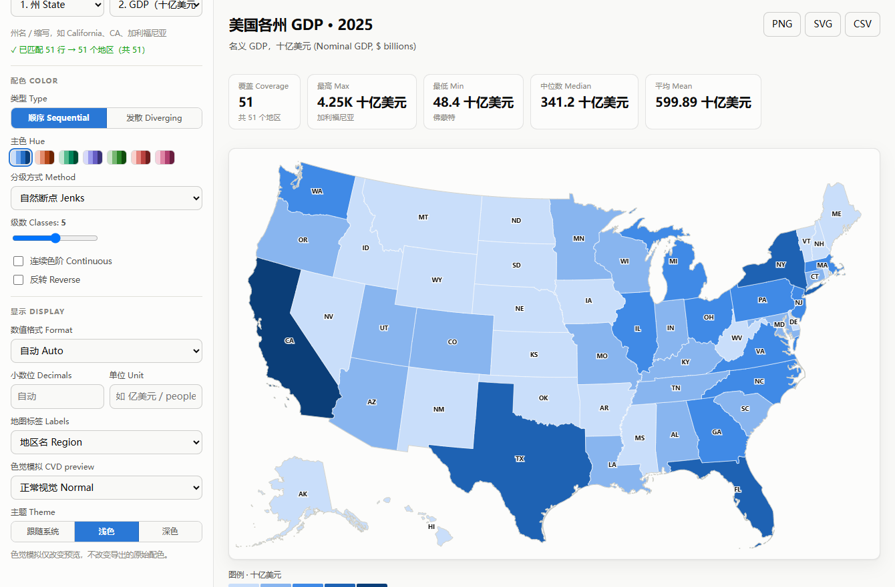
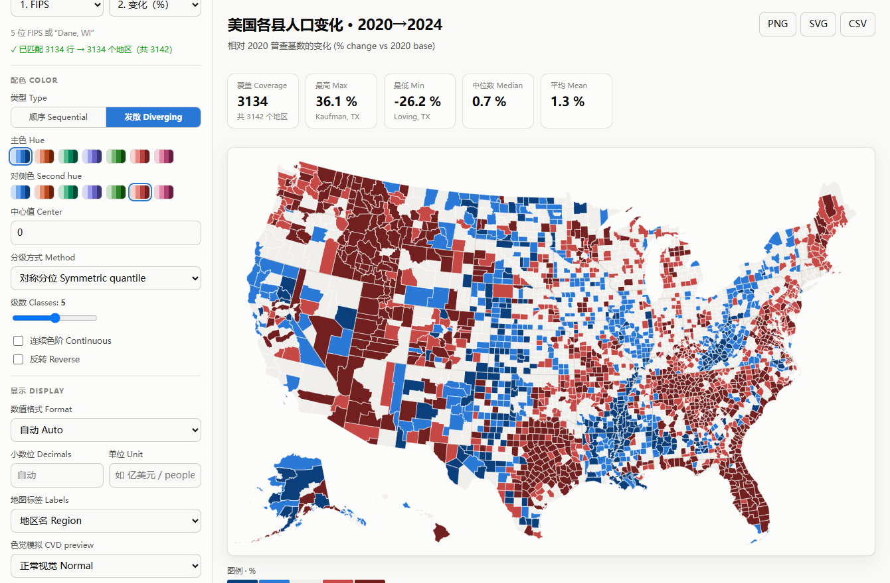
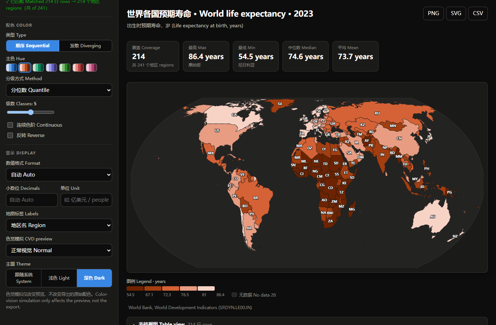

# DataMap 数据地图

*[English](README.md)*

粘贴任意「地区 + 数值」两列数据，立刻得到一张配色合规的**分级统计地图 (choropleth map)**。
支持美国各州、美国各县 (3,142)、世界各国 (240)。纯静态页面，无后端、无 CDN、可离线运行。



---

## 它解决什么问题

做一张「按数值给地区上色」的地图，通常要装 GIS 工具、找 shapefile、手工对齐地区名。
DataMap 把这三件事都内置了：

| 痛点 | 处理方式 |
|---|---|
| 找地理边界 | 内置 TopoJSON 底图（us-atlas / world-atlas），已随仓库分发 |
| 地区名对不上 | 内置别名索引：中英文、ISO 2/3 位码、FIPS、缩写、俗称全部可用 |
| 配色难看又不可读 | 色阶在 OKLCH 空间生成，单色相、亮度单调，通过色盲 (CVD) 与对比度校验 |
| 分级方式选不对 | 分位数 / 自然断点 Jenks / 等距 / 对数 / 对称分位，一键切换 |

## 功能

**数据输入**
- 粘贴（逗号 / 制表符 / 分号，可直接从 Excel 粘贴）、上传 CSV/TSV
- 自动识别表头、自动猜测「地区列」与「数值列」
- 数值容错解析：`$1,234.5万`、`7.2M`、`(1200)` 负数、`3.5%`、`1.2亿`
- **自动切换底图**：粘贴美国州名时，若当前是世界地图会自动切到美国各州
- 未匹配的行会明确列出，不静默丢弃

**地区名匹配**
```
加州 / CA / California / 06 / 6          → California
华盛顿特区 / Washington, D.C. / DC        → District of Columbia
中国 / China / CN / CHN / 156             → China
Korea, Rep. / South Korea / 韩国          → South Korea
Côte d'Ivoire / Ivory Coast / 科特迪瓦    → Côte d'Ivoire
```

**配色（遵循数据可视化规范）**
- 顺序色阶 (sequential)：单色相、亮度 100→700 单调递进，7 种色相
- 发散色阶 (diverging)：冷暖两极 + 中性灰中点，中心值可自定义
- 深色模式下**翻转锚点**——低值贴近深色背景，而非简单反色
- 分级 3–7 级，或连续色阶
- 内置**色觉模拟**：红色盲 / 绿色盲 / 蓝色盲预览（只改预览，不改导出）

**可读性**
- 图例始终存在，标注每级边界与「无数据」
- 悬停提示：地区名（中英）、数值、排名
- **表格视图**：任何颜色编码都有等价的可排序表格（不靠颜色单独传递信息）
- 直接标注只在图形放得下、且不与已有标签重叠时才渲染
- 统计卡：覆盖数 / 最高 / 最低 / 中位数 / 平均

**导出**：PNG (2×)、SVG（含内联样式）、CSV（连接后的结果）

3,142 个县 · 发散色阶 · 对称分位分级：



深色模式是重新选的步进，不是把浅色模式反过来：



## 快速开始

```bash
npm install
npm start           # → http://localhost:8123
```

只用 `index.html` + `src/` + `data/` + `vendor/` 即可运行，直接丢到任何静态托管上。

## 内置示例数据

| 数据集 | 底图 | 来源 |
|---|---|---|
| 各州 GDP 2025 | 美国各州 | U.S. Bureau of Economic Analysis |
| 各州人均 GDP 2025 | 美国各州 | BEA + Census Bureau |
| 各州实际 GDP 增速 | 美国各州 | BEA（发散色阶，以全国中位数为界） |
| 各州人口 2025 | 美国各州 | Census Bureau |
| 各县人口 2024 | 美国各县 | Census Bureau, Vintage 2024 |
| 各县人口变化 2020→24 | 美国各县 | Census Bureau（发散色阶） |
| 各国 GDP / 人均 GDP / 人口 / 预期寿命 | 世界各国 | World Bank WDI |

> 康涅狄格州 8 个旧县因 2022 年改划为规划区，底图无对应单元，显示为「无数据」——
> 未做近似映射，宁可留白也不编数据。

## 项目结构

```
index.html
src/
  app.js        主程序：状态、渲染管线、面板、导出
  color.js      OKLab/OKLCH 转换、色阶生成、CVD 模拟
  scales.js     分级算法（分位/Jenks/等距/对数/对称分位）+ 数值格式化
  parse.js      分隔符嗅探、带引号 CSV 解析、数值容错
  match.js      地区名归一化与别名索引
  samples.js    生成的示例数据（勿手改）
data/           TopoJSON 底图 + 地区别名表（由 build 生成）
vendor/         d3.min.js, topojson-client.min.js（本地化，无 CDN）
build/          数据抓取与生成脚本、色阶校验、浏览器冒烟测试
```

## 重建数据

```bash
npm run fetch     # 下载上游原始数据（World Bank / Census / Wikipedia / ISO 3166）
npm run data      # 生成 data/*.json 与 src/samples.js
npm run check     # 校验所有色阶：亮度单调、相邻 ΔE、CVD 分离度
npm run test      # Playwright 冒烟测试：全部示例 + 全部控件 + 导出 + 窄屏
npm run regress   # 回归测试：多列切换、刷新持久化、清空、连续色阶、发散分布
```

`npm run check` 对 7 种色相 × 2 主题 × 3 级数共 42 条顺序色阶
和 6 条发散色阶做校验，全部通过才退出 0。

## 设计约束

配色不是手挑的，是算出来的：

- **顺序 = 单色相，亮度单调**。蓝色直接采用参考色板的 100→700 原始色值；
  其余色相复用同一条 L/C 轨迹，仅替换色相角，因此单调性由构造保证。
- **发散 = 冷暖两极 + 中性灰中点**。不用双冷色（中点读不出「无差异」），不用彩虹色。
- **分级不超过 7 级**。再多相邻级别就分不开了，那时该看表格。
- **颜色不单独承载信息**。表格视图、图例、悬停提示都能读到同一个值。
- **深色模式是重新选步进，不是反色**。

色阶通过 `dataviz` 规范的 `validate_palette.js --ordinal` 校验（light / dark 双主题，exit 0）。

## 许可

代码 MIT。地理数据来自 [us-atlas](https://github.com/topojson/us-atlas) /
[world-atlas](https://github.com/topojson/world-atlas)（Natural Earth，公有领域）。
示例数据版权归各自来源所有，仅作演示用途。
